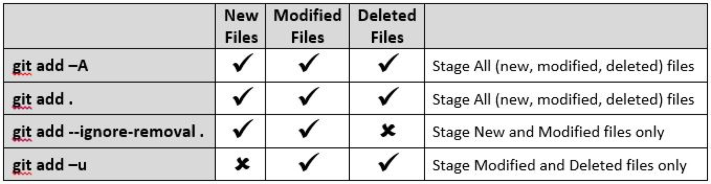
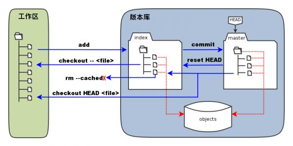
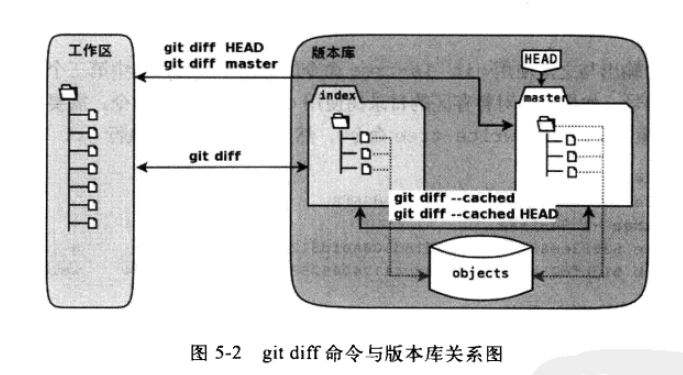

# Add and Commit

[TOC]

git 版本提交的命令由 `add` 和 `commit` 两个命令完成，其他都是用来辅助这两条指令的。

## 添加（add）


git add <file|directory>
在 git 仓库目录下任意修改文件，例如。
```
echo "Hello." > welcome.txt    #在demo中添加一个文件
git add welcome.txt    #将新建立的文件添加的版本库
```

实际上 add 的文件并没有提交到仓库中，而是将文件加入到提交任务中，保存在一个缓存区中，想要保存到仓库中，成为一个版本，需要执行 `commit` 命令。


总结：

- git add -A  / git add . 提交所有变化

- git add -u  提交被修改(modified)和被删除(deleted)文件，不包括新文件(new)

- git add --ignore-removel  提交新文件(new)和被修改(modified)文件，不包括被删除(deleted)文件


Git Version 2.x:



## 提交（commit）

```
git commit -m "initialized."    #git在添加后还要再进行一次提交操作，在提交时git强制输入提交说明，如果在提交时不在命令行提供提交说明，git会打开一个编辑器。

[master (root-commit) 8d806c2] initliazed.

 1 file changed, 1 insertion(+)

 create mode 100644 welcome.txt

＃通过-m参数设置提交说明为："initialized."。

#从输出的第一行可以看出，此次提交是提交在名为master的分之上，且是该分支的第一个提交 (root-commit)，提交ID为8d806c2；

#第二行可以看出，此次提交修改了一个文件，包含一行的插入。

#第三行可以看出，此次提交创建了新文件welcome.txt

执行一次空（没有修改文件）提交

git commit --allow-empty -m "Empty commit."

```

对最新的提交进行修改，而不产生新的提交

```
git config --amend --allow-empty --reset-author
```

为什么提交一次需要两条指令？这么设计的目录是什么？

### 工作区、暂存区、版本库

> git缓存区

    git的设计中使用了暂存区的概念。在文件被修改后立即提交，发现提示根本没有文件需要提交。需要使用git add命令添加文件，将文件添加到缓存区，然后才能提交到最终的库中。这里说明git库的三个文件状态：

1. 当前文件/工作区——（git add命令）——>
2. 暂存区文件——(git commit命令)——>
3. 最新提交

深入理解暂存区的概念



- 工作区即项目的目录
- 版本库即项目目录下的 `.git` 目录


    `.git` 目录下有一个 `index` 文件，文件.git/index实际上就是一个包含文件索引的记录，像是一个虚拟的工作区。这个虚拟的工作区中记录了工作区中的目录树、文件名和文件的状态信息（时间戳和长度等）。文件的内容并没有保存在其中，而是保存在Git对象库.git/objecteds目录中，文件索引建立了文件和文件对象实体之间的对应。下图展示了工作区，版本库中的中暂存区，和版本库之间的关系：

- index标记的区域是暂存区，标记位master的是master分支所代表的目录树。
- HEAD为指向master分支的一个“指针”，或者叫“游标”，
- objects标识的区域位git的对象库，位于.git/objects目录下。

> 以下操作会在各指令讲解时具体说明

- 当对工作区进行修改后执行git add命令时，暂存区的目录树将被更新，同时工作区修改的文件内容会被写入到对象库中的一个新的对象中，而该对象的ID被记录在暂存区的文件索引中。
- 当执行提交操作（git commit)时，暂存区的目录树会被写入到版本库（对象库）中，master分支会做相应的更新，即master最新指向的目录树就是提交时原暂存区的目录树。
- 当执行git reset HEAD命令时，暂存区的目录树会被重写，会被master分支指向的目录所替换，但是工作区不受影响。
- 当执行git rm --cached <file>命令时，会直接从暂存区删除文件，工作区不做改变。
- 当执行git checkout .　或git checkout -- <file>命令时，会用暂存区全部的文件或制定的文件替换工作区中的文件。这个操作很危险，会清除工作区中未添加到暂存区的改动。
- 当执行git checkout HEAD . 或git checkout HEAD <file>命令时，会用HEAD指向的分支中的全部或部分文件替换暂存区和工作区中的文件。这个命令极其危险，不但会清除工作区中未添加的改动，也会清除暂存区中未提交的改动。

#### 工作区、暂存区和版本库的目录树浏览

> HEAD 指向的目录树，可以使用 git 的底层命令 `ls-tree` 查看。

```
$ git ls-tree -l HEAD # 查看HEAD指向的目录树。
100644 blob d1bcf5b8fbe5c97f9bc0c63c8e1e67f906e85879      19    welcome.txt
```
-l　显示文件的大小
输出：
- 第一个字段是文件属性（rw-r--r--)
- 第二个字段说明是git对象库中的一个blob对象（文件）
- 第三个字段是该文件对应的ID——一个４０位的SHA1哈希值格式的ID，
- 第四个字段是文件的大小
- 第五个字段是文件名

> 查看暂存区的目录树

```
$git ls-file -s
100644 690ab0ff0c1d3c418963d1a6953c2a17263e6774 0   a.txt
100644 609d14d2aa1d826fa049c5d5dd2847c8e14fe4be 0   welcome.txt
```
注意这里的的第三个字段不是文件大小，而是暂存区的编号。

如果想要针对暂存区的目录树使用git ls-tree命令，需要现将暂存区的目录树写入git对象库
```
$ git write-tree  #写入git对象库
c8e26258bb038e98062ae05ecf0461e2ae45620a
[bool@bool-pc demo]$ git ls-tree -l c8e2625　　＃使用git　ls-tree命令需指定ID值，可以只写一部分，保证唯一就行。
100644 blob 690ab0ff0c1d3c418963d1a6953c2a17263e6774      10    a.txt
100644 blob 609d14d2aa1d826fa049c5d5dd2847c8e14fe4be      25    welcome.txt
```

递归地显示目录树

```
$ git write-tree | xargs git ls-tree -l -r -t
```


## 状态（status）

工作树和仓库在被操作的过程中，状态会不断发生变化。git 提供了一个可以查看当前工作修改状态的命令 `status`。

> git status

```
$ git status
#查看当前的状态
On branch master #当前分支为master
Changes not staged for commit: #更改不会被提交的文件
  (use "git add <file>..." to update what will be committed)
  (use "git checkout -- <file>..." to discard changes in working directory)
​
    modified:   welcome.txt
​
no changes added to commit (use "git add" and/or "git commit -a")
```
> 精简的状态输出

$ git status -s #显示精简输出
 M welcome.txt #第一列空着，第二列M

M(Modified) 所在的位置不同，代表该文件所处的状态不同。
M 在第一个字符，中间状态（add 之后）和版本库文件的差别。(还有一个字符是A(add)) 表示这个文件是新加的。
M 在第二个字符，表示工作区有待add的修改。
如果 add 了修改后，又有修改，则两个 M 都会出现。

> 可选项

- s (short)精简显示
- b (branch)附带分支信息


## 修改内容（diff）

通过使用不同的参数，可以对工作区、缓存区、HEAD 指向的内容两两比较。


### 可以查看仓库中的文件和上一个版本之间的差别

git diff

如果 add 文件之后，执行该指令，发现没有任何输出，想要比较 add 之后的文件和上一版本的差别。需要天机 `DEAD` 参数。

```
$ git diff #比较工作树与暂存区文件的差异，可以看到只有Second被标为添加，First则没有标注
diff --git a/welcome.txt b/welcome.txt
index 609d14d..4bde29e 100644
--- a/welcome.txt
+++ b/welcome.txt
@@ -1,3 +1,4 @@
 hello!
 Author:bool
 First
+Second
[bool@bool-pc demo]$ ls
a  a.txt  welcome.txt
```

### 比较缓存区（ADD之后）和上一版本之间的差别

git diff --cached
或
git diff --staged

```
$ git diff --cached #比较暂存区和最新提交的差异。--cached和--staged参数都行，输出效果一样。
diff --git a/welcome.txt b/welcome.txt
index d1bcf5b..609d14d 100644
--- a/welcome.txt
+++ b/welcome.txt
@@ -1,2 +1,3 @@
 hello!
 Author:bool
+First
```

### 工作区和上一个版本之间的差别(比较缓存区和上一版本)

git diff HEAD

```
$ git diff HEAD #HEAD为当前版本库的头指针, 比较工作树和最新提交的差异。可看到First,Secone都被标位增加的。他们都为提交
diff --git a/welcome.txt b/welcome.txt
index d1bcf5b..4bde29e 100644
--- a/welcome.txt
+++ b/welcome.txt
@@ -1,2 +1,4 @@
 hello!
 Author:bool
+First
+Second
```


### 直接将两个分支上最新的提交做diff

git diff topic master 或 git diff topic..master

输出自topic和master分别开发以来，master分支上的changed。

```
git diff topic...master
Changes that occurred on the master branch since when the topic
 branch was started off it
```

### 其他参数

- 查看简单的diff结果，可以加上--stat参数
git diff --stat

- 查看当前目录和另外一个分支的差别
    git diff test
显示当前目录和另一个叫'test'分支的差别
    git diff HEAD -- ./lib
显示当前目录下的lib目录和上次提交之间的差别（更准确的说是在当前分支下）

### 比较上次提交commit和上上次提交

git diff HEAD^ HEAD

^ 表示父提交，HEAD^^ 表示 HEAD^ 的父提交。以此类推。

### 比较两个历史版本之间的差异
git diff SHA1 SHA2


## 查看提交(log)

用于查看过去所有的提交记录，包括什么人在什么时候进行了提交或合并，以及操作前后有怎样的差别。

git log --stat

--stat 参数查看每次提交的文件变更统计信息。

--amend 是对刚刚提交的提交进行修补，这样就可以改正前面的提交中错误的用户名和邮件地址，而不用产生另外的新提交。
--allow-empty 使得空提交被允许，之所以这里需要使用，是因为修补的是一个空白提交。
--reset-author 将 Author 的 ID 同步修改，否则只会影响提交者的 ID，使用此参数也会重置 AuthorDate 信息。


如果只想显示提交信息的一行描述。可以使用
git log --pretty=short

只显示指定目录文件的日志
git log --pretty=oneline #用一行显示日志输出

1.6.3 开始可以使用 --oneline 显示更加精简的输出。

显示文件的改动
git log <文件或目录名>
git log -p <文件名>


## 问题

> git 命令的执行位置在不同位置是如何确定仓库的？

工作区根目录的.git目录是版本库。`git grep "内容"` 用来搜索工作区的内容，那么git的版本库放在工作区目录下，那么git的相关操作一定要在工作区根目录下执行吗？如果在子目录下执行git命令时，git如何定位版本库呢？

实际上，当在git工作区的某个目录下执行操作时，会在工作区的目录中一次向上递归查找.bit版本库，找到.git目录就是工作区对应的版本库。.git所在目录就是工作区的根目录。文件.git/index记录了工作区文件的状态（实际上时暂存区的状态）。

例如会在非git工作区执行git命令会找不到.git目录而报错。

$ cd

$git status

fatal: Not a git repository (or any of the parent directories): .git

> 追踪命令的执行过程

如果使用strace命令去跟踪执行git status命令时的磁盘访问，会看到延目录一次向上递归的过过程

$strace -e 'trace=file'  git status


> 应该被禁止的命令git commit -a

git commit加上 -a参数，对工作区所有的变更文件进行提交，这个命令的确能减少git add命令标识变更的文件的步骤，但是对丢掉暂存区带来的巨大好处。对提交的内容进行控制的能力。为git commit -a设置别名的做法更是不可取的。
保存当前工作进度

> git 如何判断文件更改的

.git/index文件记录了文件的最后修改时间

```
# 查看 .git/index 的最后更改时间。
$ ls --full-time .git/index
-rw-r--r-- 1 bool bool 198 2016-12-31 23:49:05.360205654 +0800 .git/index　＃时间为23:49:05
[bool@bool-pc demo]$ git status -s
M  welcome.txt
[bool@bool-pc demo]$ ls --full-time .git/index
-rw-r--r-- 1 bool bool 198 2016-12-31 23:49:05.360205654 +0800 .git/index　＃时间仍为23:49:05

[bool@bool-pc demo]$ touch welcome.txt
[bool@bool-pc demo]$ git status -s
M  welcome.txt
[bool@bool-pc demo]$ ls --full-time .git/index
-rw-r--r-- 1 bool bool 198 2017-01-01 00:10:05.306942142 +0800 .git/index　＃时间变为00:10:05
```

git status命令（或者git diff命令）扫描工作区改动的时候，先根据.git/index文件中记录的文件的时间戳，长度等信息判断工作区文件是否改变，如果时间戳改变了，文件内容可能被改变。才会更新index中文件的时间戳，和长度。然后读取文件进行比较。这也是git高效的原因。


 
