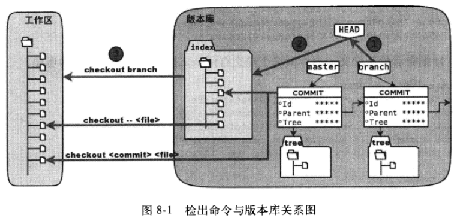

# Branch

在之前，所有的关于版本变更的操作，都是关于 `refs/heads/master` 的，并且 HEAD 始终指向 `refs/heads/master`，`git reset`重置命令的一个用途就是修改引用（如 master）的游标指向。没有改变头指针 HEAD的内容， 那么无什么要多这么一层指向？HEAD的指向是否能够改变，并且 `master` 又是什么一个含义呢？这就引出 git 的另一个重要概念：**分支**


[TOC]


git branch——显示分支一览表
带星号的表示当前正在所在的分支

git checkout -b——创建，切换分支
如在master分支上建立一个分支feature-A，并切换到feature-A分支下。
git checkout -b feature-A
等同于如下两句
git branch feature-A    #创建分支
git checkout feature-A  #切换分支
这时再对文件进行提交都是在feature-A进行的，在这个状态下像正常开发那样进行提交。我们称之为“培育分支”。
在该分支进行的提交并不会改变其他分支，包括主分支。
切换回上一个分支
git checkout -

特性分支与主干分支
特性分支是按分支的功能命名的，指在软件开发中为了给软件添加某一特性（功能），但为了不影响稳定分支，保证稳定分支能够随时处于能够运行状态。会为添加的特性创建一个分支，用于独立添加特性。直至该特性完全稳定了，才将其合并到主分支。（好处：主分支能够随时用于发布软件。其他开发者也能够随时从主分支创建新的特性分支）
主干分支，即我们用户分布软件的稳定分支。通常使用默认创建的master分支作为主分支。主干分支也可以有多个，用于不同的发行。
git merge——合并分支
假设我们的feature-A已经开发测试完毕，想将它合并到主干分支master中。首先切换到master分支中。
git checkout master
然后合并feature-A分支。为了在历史记录中明确记录下本次合并，首先我们需要创建合并分支。因此，在合并时加上--no-ff参数。
git merge --no-ff feature
随后编辑器会启动，用于录入合并提交的信息。
默认信息中已经包含了从freature-A中合并过来的相关内容，所以可不必做任何修改。保存编辑器中的内容即可。此时会提示合并的信息。

git log --graph——以图标形式查看分支


## 切换分支名

```bash
git branch -m old_branch new_branch # Rename branch locally 

git push origin :old_branch # Delete the old branch 

git push --set-upstream origin new_branch # Push the new branch, set local branch to track the new remote
```


>>>>>>>>>>>>>>>>>>>>>>>>>>>>>


由于太多人问怎么撤销 merge 了，于是 git 官方出了这份教程，表示在 git 现有的思想体系下怎么达到撤销 merge 的目标。

方法一，reset 到 merge 前的版本，然后再重做接下来的操作，要求每个合作者都晓得怎么将本地的 HEAD 都回滚回去：

$ git checkout 【merge操作时所在的分支】
$ git reset --hard 【merge前的版本号】
方法二，当 merge 以后还有别的操作和改动时，git 正好也有办法能撤销 merge，用 git revert：

$ git revert -m 【要撤销的那条merge线的编号，从1开始计算（怎么看哪条线是几啊？）】 【merge前的版本号】
Finished one revert.
[master 88edd6d] Revert "Merge branch 'jk/post-checkout'"
 1 files changed, 0 insertions(+), 2 deletions(-)
这样会创建新的 commit 来抵消对应的 merge 操作，而且以后 git merge 【那个编号所代表的分支】 会提示：

Already up-to-date.
因为使用方法二会让 git 误以为这个分支的东西都是咱们不想要的。

方法三，怎么撤销方法二：

$ git revert 【方法二撤销merge时提交的commit的版本号，这里是88edd6d】
Finished one revert.
[master 268e243] Revert "Revert "Merge branch 'jk/post-checkout'""
 1 files changed, 2 insertions(+), 0 deletions(-)
这样就行了，可以正常 merge 了，不过可能会有很多冲突噢！！

$ git merge jk/post-checkout
Auto-merging test.txt
Merge made by recursive.
 test.txt |    1 +
 1 files changed, 1 insertions(+), 0 deletions(-)
=====================简单翻译结束====================

最后的最后，还是觉得顶上那些都麻烦爆了。前端天天用 WebStorm 写代码的看过来： WebStorm 右键点击项目文件或文件夹，有一个：

Local History -> Show History

点开后出现一个窗口，可以看到所有的本地改动。找到合适的那份，按左上角那个：

Revert

按钮，也就是个紫色的弯曲的小箭头就回去了。在文件量不大的时候十分管用，强烈推荐。

------------------------------------------


git checkout 用于切换到不同的分支


git checkout <branch name>


当需要先创建一个分支，然后跳转时，你可以使用如下的指令，先创建然后跳转

git branch add <branch name>

git checkout <branch name>

当然，也可以把两步并作一步，使用如下命令

git checkout -b <branch name>

使用-b选项，该命令会先创建一个分支，然后才跳转到新的分支。


如果在修改文件文件时，导致了文件的混乱，不想要使用当前的修改时，可以使用如下命令丢弃当前未提交的修改:

git checkout .

或者使用如下命令丢弃对某个文件的修改。

git checkout --file


git checkout . #本地所有修改的。没有的提交的，都返回到原来的状态
git stash #把所有没有提交的修改暂存到stash里面。可用git stash pop回复。
git reset --hard HASH #返回到某个节点，不保留修改。
git reset --soft HASH #返回到某个节点。保留修改
​
git clean -df #返回到某个节点
git clean 参数
    -n 显示 将要 删除的 文件 和  目录
    -f 删除 文件
    -df 删除 文件 和 目录
​
也可以使用：
​
git checkout . && git clean -xdf


## branch 分支


### 查看分支
```
git branch
```
前面带 `*` 号的表名当前所在的分支，由于还没有创建新的分支，默认只会有一个 master 分支，这个分支也叫主分支，这是在版本初始化的时候 git 默认创建的，并且提交的版本都默认存在这个分支中。

添加 -a 参数，可以列出所有分支。
-r 显示远程分支
-v 同时输出分支头提交的 ID 和 提交说明。


### 创建分支

```
git branch <new-branch-name>
```

### 切换分支
```
git checkout <branch-name>
```

//创建并切换到新分支  
```
git checkout -b branchname  
```
### merge 合并分支

在日志中，可以看到我们历史操作记录commit、checkout、reset、merge。只要不进行git的GC（Garbage Collection）就可以通过日志随意调取近期的历史状态。

想要将 B 合并到 A 上，需要先回到 A 上，例如将 fix-B 合并到 master 上。
```
git checkout master

取消冲突
现在合并fix-B，就可以得到我们想要的状态。
$ git merge --no-ff fix-B
Auto-merging README.md
CONFLICT (content): Merge conflict in README.md
Recorded preimage for 'README.md'
Automatic merge failed; fix conflicts and then commit the result.
```
这时系统告诉我们README.md文件发生了冲突（Conflick）。我在做这个测试的时候根本没有发生冲突。系统在做合并README.md的时候，master 分支更改部分与本次想要合并的fix-B发生了冲突，分支更改发生了冲突。不解决冲突就无法完成合并，所以我们打开README.md文件，解决这个冲突。用编辑器打开README.md，就会发现内容编程如下的样子。
```
<<<<<<< HEAD
- master 的更改
=======
- fix-B
>>>>>>> fix-B
```
`=======` 以上的部分为HEAD的内容，以下的部分是要合并的fix-B分支的内容。我们在编辑器修改成想要的样子。然后添加，提交：
```
git add README.md
git commit -m "Fix conflict"

git commit --amend——修改提交信息
```

此时就完成了一次合并。

### 删除分支

git branch -D <branch name>

删除远程的分支

git branch -r -d origin/hongchangfirst

git push origin --delete <branchName>
#注意这个只是删除本地的索引，而不是真正删除远程分支的内容，要想真正删除远程分支上的内容，可以这样：

git push origin :hongchangfirst
注意，冒号前面的空格不能少，相当于把一个空分支push到server上，等于删除该分支。

## 完全独立的分支

在使用git进行版本控制的某些场景中我们可能需要在一个项目中建立完全独立的分支，此分支将作为一个独立的版本历史根节点，不与之前任何分支拥有相同的版本祖先。

比如当我们要在一个项目中使用一个分支进行项目文档的管理时，或者当我们想要发布一个软件的开源版本但又不希望将软件的版本历史暴露给外界时，都可以使用以下的方法建立一个独立分支。
通过带orphan参数的checkout命令建立独立分支

通过带有–orphan参数的checkout命令即可从start_point或者HEAD创建一个独立分支
```
$cd repo
$git checkout --orphan 新分支名 <start_point>
```

创建全新的独立分支

如果希望创建全新的独立分支，例如用于文档管理，则还需要进行如下删除操作
注意如果有不在索引中的文件，则需要手工删除(包括.gitignore)

删除此分支中的索引及索引中的所有文件
```
$ git rm -rf .
```
## checkout 检出

checkout 不仅有切换分支的功能，还有检出历史版本的功能。例如检出当前分支的上一版本

```
$ git branch -v
* master   5e596fd test status
$ git checkout 5e596fd^
```

输出的结果中，有一句"You are in 'detached HEAD' state."，"detached HEAD" 是什么意思呢？查看一下此时的 HEAD 内容就明白了

```
$ cat .git/HEAD
e62e90827b9700c6db7f86d17cb558966fce7c8d
```
原来，HEAD 指针不再指向一个分值引用，而是指向一个版本。

```
$ git reflog -1
```
reflog 指出，发生变迁的是 HEAD 指针，而非master游标。再对比一下 HEAD 和 master 对应的 ID，发现它们确实变得不一样了。
```
$ git rev-parse HEAD master
e62e90827b9700c6db7f86d17cb558966fce7c8d
5e596fd1bf53835ba14c694c6bb6293f6a4b7c22
```

前一个是 HEAD 头指针的指向，后一个是 master 分支的指向。而且还可以看到执行 git checkout 命令与执行 git reset 命令不同，分支（master）的指向并没有改变，仍旧指向原有的提交 ID。

现在版本库的 HEAD 是指向 e62e90827 提交的。再做一次提交，HEAD 会如何变化呢？具体操作过程如下。

1. 先做一-次修改：创建一个新文件 detached-commit.txt，添加到暂存区中。
```
$ touch detached-commit.txt

$ git add detached-commit.txt
```
2. 看一下状态，会发现其中有“当前不处于任何分支”的字样，显然这是因为 HEAD 处于“分离头指针”模式。
```
$ git status
```

3. 执行提交。在提交输出中也会出现[detached HEAD...] 的标识，这也是对用户的警示。

$ git commit -m "commit in detached HEAD mode. "

 [detached HEAd acc2 f69] commit in detached HBAD mode. 0 files changed, 0 insertions (+），0 deletions (-) create mode 100644 detached - commit. Txt

4. 此时头指针指向了新的提交。

$ cat.git/HEAD

acc2 f69 cf6 f0 ae346732382 c819080 df 75 bb2191

5. 再查看一下日志会发现新的提交是建立在之前的提交基础上的。

$ git log --graph --pretty=oneline

记下新的提交 ID (acc2f69)，然后以 master 分支名作为参数执行 git checkout 命令，会切换到 master 分支上。

- 切换到 master 分支上，再没有之前大段的文字警告。
```
$ git checkout master

Previous HEAD position was acc2f69... Commit in detached HEAD mode.

Switched to branch 'master'
```
- 因为 HEAD 头指针重新指向了分支，而不是处于“断头模式”（分离头指针模式）。
```
$ cat. Git/HEAD
```

查看 master 分支的历史会发现，刚刚提交的内容并不在 master 分支上，那刚刚提交的内容还在版本库中吗？可以用 show 指令查看。

```
$ git show acc2f69
```

可以看出这个提交现在仍在版本库中。由于这个提交没有被任何分支跟踪到，因此并不能保证这个提交会永久存在。实际上当 reflog 中含有该提交的日志过期后，这个提交随时都会从版本库中彻底清除。

### 挽救分离头指针

在“分离头指针”模式下进行的测试提交除了使用提交 ID (acc2f69) 访问之外，不能通过 master 分支或其他引用访问到。如果这个提交是 master 分支所需要的，那么该如何处理呢？如果使用上一章介绍的 git reset 命令，的确可以将 master 分支重置到该测试提交“acc2f69”，但是如果那样就会丢掉 master 分支原先的提交。使用合并操作（git merge）可以实现两者的兼顾。

下面的操作会将提交“acc2f69”合并到 master 分支中来，具体操作过程如下。

1.  确认当前处于 master 分支。
```
$ git branch -V

master 4902dc3 does master follow this new commit?
```
2. 执行合并操作，将 acc2 f69 提交合并到当前分支。
```
$ git merge acc2f69

Merge made by recursive.
0 files changed, 0 insertions (+), 0 deletions (-)
create mode 100644 detached- commit. Txt
```

3. 工作区中多了一个 detached-commit. Txt 文件。
```
$ ls

detached - commit. Txt new - commit. Txt welcome. Txt
```
4. 查看日志，会看到不一样的分支图。即在 e695606 提交开始出现了开发分支，而分支在最新的 2b31c19 提交发生了合并。

5. 仔细看看最新提交，会看到这个提交有两个父提交。这就是合并的奥秘

```
$ git cat-file -p HEAD
```
## 深入了解 git checkout 命令

检出命令（git checkout）是 Git 最常用的命令之一，同时也是一个很危险的命令，因为这条命令会重写工作区。检出命令的用法如下：

用法一：git checkout「-g] [<commit>] [--] <paths>

用法二：git checkout [<branch>]

用法三：git checkout[-m] [[-b | -- orphan] <new_ branch>] [<start_ point>]

上面列出的第一种用法和第二种种用法的区别在于，第一种用法在命令中包含路径<paths>。为了避免路径和引用（或者提交 ID）同名而发生冲突，可以在 <paths> 前用两个连续的短线（减号）作为分隔。

第一种用法的<commit>是可选项，如果省略则相当于从暂存区（index）进行检出。这和上一章的重置命令大不相同：重置的默认值是 HEAD，而检出的默认值是暂存区。因此重置一般用于重置暂存区（除非使用用 --hard 参数，否则不重置工作区），而检出命令主要是覆盖工作区。（如果<commit>不省路，也会替换暂存区中相应的文件）。

- 第一种用法（包含了路径<paths>的用法）不会改变 HEAD 头指针，主要是用于指定版本的文件覆盖工作区中对应的文件。如果省路<commit>，则会用暂存区的文件覆盖工作区的文件，否则用指定提交中的文件覆盖暂存区和工作区中对应的文件。

- 第二种用法（不使用路径<paths>的的用法）则会改变 HEAD 头指针。之所以后面的参数写作<branch>，是因为只有 HEAD 切换到一个分支才可以对提交进行跟踪，否则仍然会进入“分离头指针”的状态。在“分离头指针”状态下的提交不能被引用关联到，从而可能丢失。所以用法二最主要的作用就是切换到分支。如果省略<branch>则相当于对工作区进行状态检査。

- 第三种用法主要是创建和切换到新的分支（<new_ branch>），新的分支从 <start_point> 指定的提交开始创建。新分支和我们熟悉的master分支没有什么实质的不同，都是在refs/heads 命名空间下的引用。关于分支和 git checkout 命令的这个用法会在后面的章节具体介绍。



下面通过一些示例来具体看一下检出命令的不同用法。

- 命令：git checkout branch
检出 branch 分支。要完成如图 8-1 中的三个步骤，更新 HEAD 以指向 branch 分支，以及用 branch 指向的树更新暂存区和工作区。

- 命令：git checkout

汇总显示工作区、暂存区与 HEAD 的差异。

- 命令：git checkout HEAD
同上。

- 命令：git checkout - filename

用暂存区中 filename 文件来覆盖工作区中的 filename 文件。相当于取消自，上次执行 git add filename 以来（如果执行过）的本地修改。
这个命令很危险，因为对于本地的修改会悄无声息地覆盖，毫不留情。

- 命令：git checkout branch -- filename

维持 HEAD 的指向不变。用 branch 所指向的提交中的 filename 替换暂存区和工作区中相应的文件。注意会将暂存区和工作区中的 filename 文件直接覆盖。

- 命令：git checkout 或写作 git checkout .

注意 git checkout 命令后的参数为一个点（“.”）。这条命令最危险！会取消所有本地的修改（相对于暂存区）。相当于用暂存区的所有文件直接覆盖本地文件，不给用户任何确认的机会！

## git rebase -i——压缩历史
在合并特性之前，如果发现已提交的内容有些许拼写错误等，可以提交一次修改，然后将这个修改包含到前一次提交中，压缩成一个历史记录，这时个经常使用的技巧。

创建一个新的分支
git checkout -b feature-C
修改README.md中的内容
添加、提交一布完成
git commit -am "Add feature-A"
修改README.md后比较区别
git diff 
再次提交
git commit -am "Fix typo"
将以上两次提交合并
git rebase -i HEAD~2
