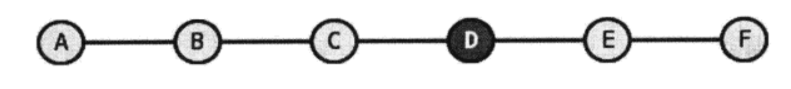
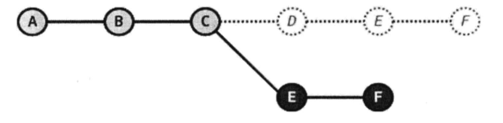
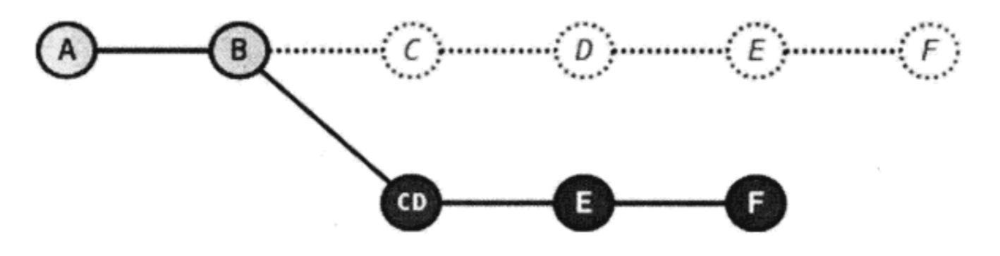

# 重置

[TOC]

——回溯历史版本

git的另一特性便是可以灵活操作历史版本。借助分散仓库的优势，可以在不影响其他仓库的前提下对历史版本进行操作。

## reset 重置版本

通过跟踪文件 `.git/HEAD`, `.git/refs/heads/master` 发现 `.git/refs/heads/master` 中存储的 `id` 值正是“最新”提交的 `id` 值。没增加一个提交，这个值都会跟着改变。 引用 `.git/refs/heads/master` 就好像一个游标，再有新的提交时，指向了新的提交。其实，git 可以通过 `reset` 指令指向任何一次提交，

*** 注意以下指令使用了 `--hard` 参数，会破坏工作区中未提交的改动，慎用 ***

```
$ git reset --hard HEAD^
# 可以查看文件 `.git/refs/heads/master` 也发生了改变。
$ cat .git/refs/heads/masters
```
查看文件内容，发现文件的内容也改变了，变为上次版本的内容。实际上，这条指令将工作区的内容重置到了上一次版本的内容。

使用重置后，log 只能显示重置节点之前的提交，而无法显示重置之后的提交，想要通过 log 找到历史节点

### 压缩历史提交

在一些场景中，需要将多个版本合并为一个历史提交。例如，在开发一个新功能的时候，提交了多次更改。当完成该功能合并到上线版本的时候。就想要将多个版本合并为一次提交。
$ git reset --sort <commit_id/tag>
然后从新建立提交。

```
$ git reset --sort HEAD^^
$ git commit -m "Feature A"
```


### 改变历史


## reflog 操作历史

当使用 `reset` 重置版本之后，使用 `log` 发现，展现的都是重置节点之前的内容，重置的节点之后的内容都找不到了，想要再回到重置节点之后的地方，通过log无法找到节点号。这时候就只能通过 `relog` 指令查找操作了。

如果没有记下重置前 master 分支指向的提交 ID，想要重置回原来的提交似乎是一件麻烦的事情（去对象库中一个一个地找）。幸好 Git 提供了一个挽救机制，通过。Git/ logs 目录下日志文件记录了分支的变更。默认非裸版本库（带有工作区）都提供分支日志功能，这是因为带有工作区的版本库都有如下设置：

```
$ git config core.logallrefupdates
true
```

查看一下 master 分支的日志文件。Git/ logs/ refs/heads/master中的内容。下面的命令显示了该文件的最后几行。。

```
$ tail -5 .git/logs/refs/heads/master
```

可以看出这个文件记录了 master 分支指向的变迁，最新的改变追加到文件的末尾，因此最后出现。最后一行可以看出因为执行了 git reset --hard 命令，指向的提交 ID 由 c695606 改变为 9e8a761。

Git 提供了一个 git reflog 命令，对这个文件进行操作。使用 show 子命令可以显示此文件的内容。
```
$ git reflog show master | head -5

5e596fd master@{0}: reset: moving to HEAD^
644c890 master@{1}: commit: test status
5e596fd master@{2}: commit: test status
e62e908 master@{3}: commit (initial): Empty commit.
```

查看 `git reflog` 的输出和直接查看日志文件最大的不同在于显示顺序的不同，即最新改变放在了最前面显示，而且只显示每次改变后最终的 SHAl 哈希值。还有个重要的区别在于 `git reflog` 命令的输出中还提供了一个方便易记的表达式：`<refname>@{<n>｝`。这个表达式的含义是引用 `<refname>` 之前第 n 次改变时的 SHA1 哈希值，即使用 `master@{n}` 和其之前的 ID 值标识是等效的。

那么将引用 master 切换到两次变更之前的值，可以使用下面的命令。

- 重置 master 为两次改变之前的值。
```
$ git reset --hard master@{2}

HEAD is now at 4902dc3 does master follow this new commit?
```
`master@{2}` 也可以换成之前的 SHL1 ID 值。

- 重置后工作区中的文件又回来了。提交历史也回来了。
```
$ git log --oneline
```
此时如果再用 `git reflog` 查看，会看到恢复 master 的操作也记录在日志中了。
```
$ git reflog show master | head -5
```


## 深入了解 reset 命令

重置命令（git reset）是 Git 最常用的命令之一，也是最危险最容易误用的命令。来看看 git reset 命令的用法。

用法一(就是 git reset --mixid 的简写形式)：git reset  [-q] [<commit>]  [--] <paths>...

用法二：git reset  [--soft | --mixed | --hard | --merge | -- keep]  [-q]  [<commit>]

上面列出了两个用法，其中《commit》都是可选项，可以使用引用或提交 ID，如果省略 <commit> 则相当于使用了 HEAD 的指向作为提交 ID。

上面列出的两种用法的区别在于，第一种用法在命令中包含路径 <paths>。为了避免路径和引用（或者提交 ID）同名而发生冲突，可以在<paths>前用两个连续的短线（减号）作为分隔。

- 第一种用法（包含了路径 <paths> 的用法）不会重置引用，更不会改变工作区，而是用指定提交状态（<commit>）下的文件（<paths>）替换掉暂存区中的文件。例如命令 `git reset HEAD  <paths>`相当于取消之前执行的 git add  <paths> 命令时改变的暂存区。

- 第二种用法（不使用路径<paths>的用法）则会重置引用。根据不同的选项，可以对暂存区或工作区进行重置。参照下面的版本库模型图，来看一看不同的参数对第二种重置语法的影响。


命令格式：git reset  [--soft | --mixed | --hard]  [<commit>]

- 使用参数--hard，如：git reset --hard  <commit>。会执行上图中的全部动作①、②、③，即：
    1. 替换引用的指向。引用指向新的提交 ID。
    2. 替换暂存区。替换后，暂存区的内容和引用指向的目录树一致。
    3. 替换工作区。替换后，工作区的内容变得和暂存区一致，也和 HEAD 所指向的目录树内容相同。

- 使用参数--soft，如：git reset --soft  <commit>。会执行上图中的操作①。即只更改引用的指向，不改变暂存区和工作区。

- 使用参数--mixed 或不使用参数（默认为--mixed），如：git reset  <commit>。会执行上图中的操作①和操作②。即更改引用的指向及重置暂存区，但是不改变工作区。

下面通过一些示例，看一下重置命令的不同用法。

- 命令：git reset

仅用 HEAD 指向的目录树重置暂存区，工作区不会受到影响，相当于将之前用 git add 命令更新到暂存区的内容撤出暂存区。引用也未改变，因为引用重置到 HEAD 相当于没有重置。

- 命令：git reset HEAD

同上。

- 命令：git reset -- filename

仅将文件 filename 的改动撤出暂存区，暂存区中其他文件不改变。相当于对命令 git add filename 的反向操作。

- 命令：git reset HEAD filename

同上。

- 命令：git reset --soft HEAD^

工作区和暂存区不改变，但是引用向前回退一次。当对最新提交的提交说明或提交的更改不满意时，撤销最新的提交以便重新提交。

在之前曾经介绍过一个修补提交命令 `git commit --amend`，用于对最新的提交进行重新提交以修补错误的提交说明或错误的提交文件。修补提交命令实际上相当于执 行了下面两条命令。(注;文件.git/COMMIT_ EDITMSG 保存了上次的提交日志。）
```
$ git reset --soft HEAD^
$ git commit -e -E.git/CoMMIT_ EDITMSG
```

- 命令：git reset HEAD^

工作区不改变，但是暂存区会回退到上一次提交之前，引用也会回退一次。

- 命令：git reset --mixed HEAD^

同上。

- 命令：git reset --hard HEAD^

彻底撒销最近的提交。引用回退到前一次，而且工作区和暂存区都会回退到上一次提交的状态。自上一次以来的提交全部丢失。


> 从上面的情况可以得出结论

- `--hard` 适合用户回到历史某一版本查看、操作内容或者丢弃一些版本，从新建立版本，因为工作区的内容也跟着回到了过去。
- `--mixed` 适合于压缩版本，将几次提交从新提交为一次提交。因为只是将缓存区和提交回到了历史上某节点，而工作区并未改变。如果未指定或指定为 HEAD 索引，则是将 add 的内容撤销。
- `--soft` 作用并不大，常用于撤销一次提交，从新提交内容。


## 更改历史

git 就像一台时光机，更改历史提交后，即使后继提交的内容和属性都一致但是因为后继提交中有一个属性是父提交的 SHA1 哈希值，所以一个历史提交的改变会引起连锁变化，导致所有后继提交都发生变化，形成链条平行的时间线：一条是变更前的提交时间线，另一条是变更后的时间线。

### 拣选操作

拣选指令（git cherry-pick）实现提交在新的分支上的“重放”。是从众多的提交中挑选一个提交应用在当前的分支中。该指令需要提供一个提交 ID 作为参数，提交过程相当于将该提交导出为补丁文件，然后在当前 HEAD 上重放，形成无论内容还是提交说明都一致的提交。

#### 丢弃
> 需求

假设有从先到后的一系列提交 A、B、C、D、E、F。为了便于识别，我们通过打 `tag` 标识。
```
$ git tag F
$ git tag E HEAD^
$ git tag D HEAD^^
$ git tag C HEAD^^^
$ git tag B HEAD^4
$ git tag B HEAD~4
$ git tag A HEAD~5
```




其中 D 是一次无用的提交，想要将其从历史中移除。即将 E 直接嫁接得到提交 C 上。



> 拣选过程

1. 首先要将 D 之前的版本检出

```
$ git checkout C
```
检出之后会处于分离头指针的状态。

2. 重放 D 之后的所有提交
执行拣选操作将 E 提交在当前 HEAD 上重放
```
$ git cherry-pick master^
```
执行拣选操作将 E 提交在当前 HEAD 上重放
```
$ git cherry-pick master^
```

**拣选操作只能将提交重放到新的临时分支上，定位到原节点上的 tag 并不会被放置。因为重放之后的 SHA1 哈希值已经变了。**

通过日志还可以看出，最新两次提交的 `AuthorDate` 和 `CommitDate` 不同。 `AuthorDate` 是版本的创建日期 `CommitDate` 是拣选操作时间，说明是一次重新的提交。

3. 将 master 分支重置到新的提交 ID 上。

```
$ git checkout master
$ git reset --hard HEAD@{1}
```
HEAD@{1} 使用了 reflog 的语法，是指 master 分支之前的 HEAD 指向的节点。


#### 丢弃
> 恢复原有历史

拣选只是新建立了一个分支，原有的分支和 tag 都在，想要恢复回之前的分支，只需要重置会之前的头结点即可。

```
$ git reset --hard F
```
这里使用了 tag F，实际上使用哈希值和其他能唯一确定提交节点的值都是可以的。


将 D 和 C 合并为一个提交，E 和 F 重新嫁接到 “CD” 复合提交上。



1. 要将 C 和 D 合并，需要先回到 D

```
$ git checkout D
```

2. 恢复 C 和 D 需要提交的代码
```
$ git reset --soft HEAD^^
```

3. 执行提交，提交说明重用 C 的提交说明
```
$ git commit -C C
```

4. 将 E 和 F 重放到当前临时分支上
```
$ git cherry-pick E
$ git cherry-pick F
```

5. 将 master 分支指向新的提交 ID
```
$ git checkout master
$ git reset --hard HEAD@{1}
```

### 变基操作

#### 删除节点

重置回顺序的节点，用户测试。
```
$ git checkout master
$ git reset --hard F
```

`git rebase` 是对提交执行变基操作，即可以实现将制定范围的提交“嫁”接到另一个提交之上。

```
$ git rebase        <newbase>         [<till>]
$ git rebase --onto <newbase> <since> [<till>]
$ git rebase -i ...
```

很显然为了执行将 E 和 F 提交跳过提交 D，“嫁接”到提交 C 上。可以如此执行变基命令：

```

$ git rebase --onto C E^ F
```
因为 E^等价于 D，并且 F 和当前 HEAD 的指向相同，因此可以这样操作：
```
$ git rebase --onto C D
```

重置头节点，将 master指向变基后的链

```
$ git checkout master
$ git reset --hard HEAD@{1}
```

**因为之后 <till> 不是一个分支时，才会先执行一次 checkout，因为上面的操作可以使用一个指令就能完成，只需要改变一下 <till> 的节点表示方式**
```
$ git rebase --onto C E^ master
```

#### 合并节点

通用先重置历史顺序。
```
$ git reset --hard F
```

将 C 和 D 合并

```
$ git checkout D
$ git reset --soft HEAD^^
$ git commit -C C
// 记住这提交 ID， 或者打个 tag
$ git tag newbase
$ git rev-parse newbase

// 执行变基操作
$ git rebase --onto newbase E^ master
```

恢复一下，方便后继操作

```
$ git reset --hard F
```


### 交互式变基操作

```
$ git reset --hard F
```

#### 丢弃 D

```
$ git rebase -i D^

pick cc3d5c5 D
pick dd2b2c1 E
pick 7440e4b F

# Rebase 8025881..7440e4b onto 8025881 (3 commands)
#
# Commands:
# p, pick = use commit
# r, reword = use commit, but edit the commit message
# e, edit = use commit, but stop for amending
# s, squash = use commit, but meld into previous commit
# f, fixup = like "squash", but discard this commit's log message
# x, exec = run command (the rest of the line) using shell
# d, drop = remove commit
#
# These lines can be re-ordered; they are executed from top to bottom.
#
# If you remove a line here THAT COMMIT WILL BE LOST.
#
# However, if you remove everything, the rebase will be aborted.
#
# Note that empty commits are commented out
```

删除 D 所在的行

```
pick dd2b2c1 E
pick 7440e4b F
```
保存退出，变基即可开始，如果出现了冲突，解决冲突，然后将改动的文件加入跟踪。执行
```
git rebase --continue
```
成功显示
Successfully rebased and updated refs/heads/master.

#### 融合提交 C，D
重置场景
```
$ git checkout master
$ git reset --hard F
```
因为要将 C 和 D 融合，C也需要加入到提交
```
$ git rebase -i C^
```

将 D 的 pick 动作改为 squash
```
pick 8025881 C
squash cc3d5c5 D
pick dd2b2c1 E
pick 7440e4b F
```
保存退出，自动开始变基操作。在执行到 squash 命令设定的提交时，进入提交前的日志编辑状态。很明显 C 和 D 的提交说明显示在一起了。

此时可以编辑要合并的提交的日志。然后保存后会继续执行后继的提交。
```
$ git log --oneline --decorate -6
```
可以看到融合 C 和 D 的提交日志实际上是两者日志的融合。在前面当行现实的日志看不出来。
```
$ git cat-file -p HEAD^^
tree 0e8f4b20a787a9f7c9bf7a4881d6c5164e1dc1a2
parent ed7b545ba8e2900a80edc266db345301acaff4b5
author Yaowen <you@example.com> 1533607194 +0800
committer Yaowen <you@example.com> 1534820829 +0800

C & D
```
