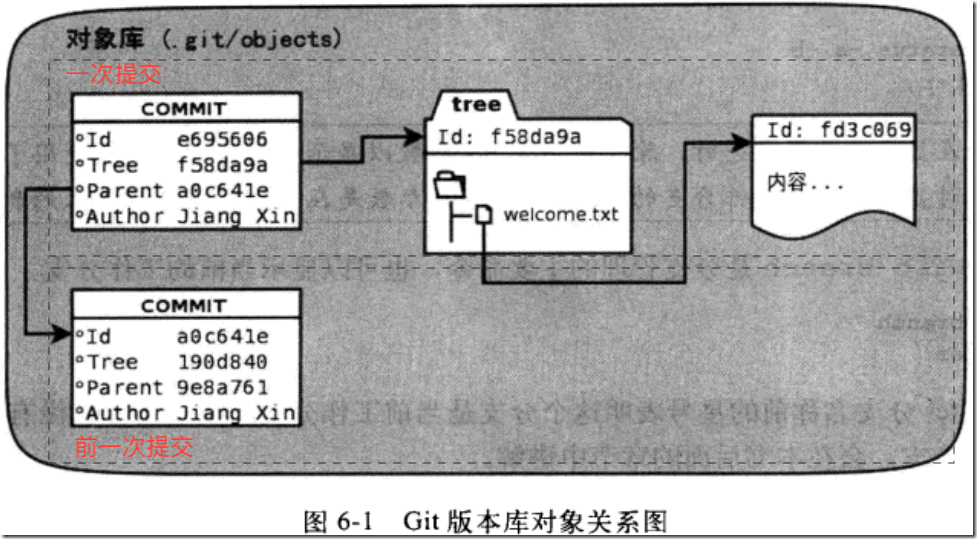
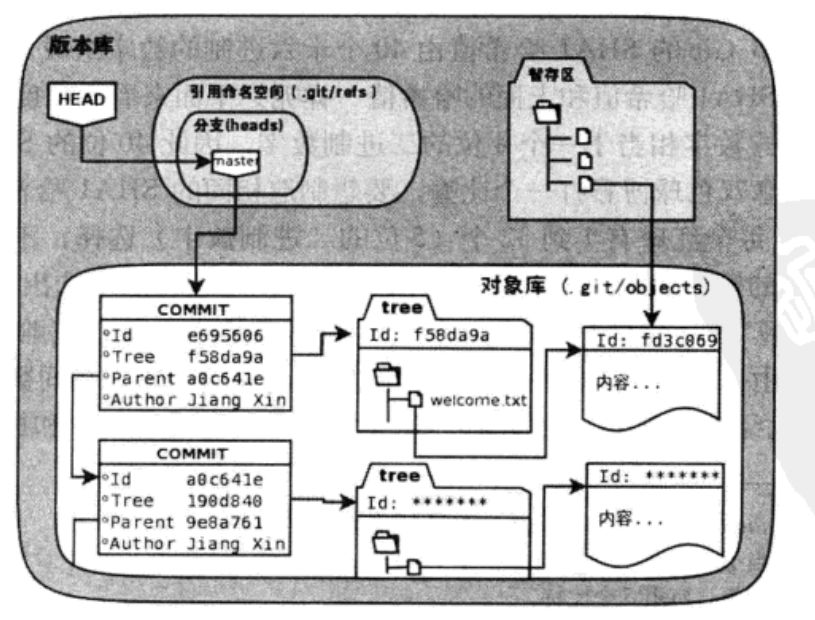

# git 对象

在查看 git 历史时，总会看到一个40位没有任何规律的字符串。这其实是 git 的对象 ID，它是一个 SHA1 哈希值。git使用SHA1哈希值生成的４０位十六进制数字作为提交ID.

## 版本对象

> 查看详细的提交信息

```
$ git log -l --pretty=raw

commit 0c63c813be5f927bfea92c4d96d7532b07e22478:这是本次提交的唯一标识
tree fc4d9e1fd54cf5efd8979aa3bf45ee52051baa2c：这是本次提交所对应的目录树
parent 88b0a027797b38124eb4e50a572609cef186d701：这是本次提交的父提交（上一次提交）
```

一个提交中包含了三个SHA1哈希值对象ID:

研究git对象ID的一个重量级武器就是git cat-file命令。用下面的命令可以查看一下三个ID的类型。可以仅使用ID的一部分，不冲突即可
```
$ git cat-file -t 0c63c81
commit
$ git cat-file -t fc4d9
tree
$ git cat-file -t 88b0a
commit
```
- t 表示 type

下面再使用git　cat-file查看一下这几个对象的内容。
commit对象0c63c813be5f927bfea92c4d96d7532b07e22478

```
$ git cat-file -p 0c63c81
tree fc4d9e1fd54cf5efd8979aa3bf45ee52051baa2c
parent 88b0a027797b38124eb4e50a572609cef186d701
author guobool <guobool@163.com> 1478364674 +0800
committer guobool <guobool@163.com> 1478364674 +0800

```

详细看一下各个 对象的不同

tree对象fc4d9e1fd54cf5efd8979aa3bf45ee52051baa2c
```
$ git cat-file -p fc4d9e1f
100644 blob 690ab0ff0c1d3c418963d1a6953c2a17263e6774    a.txt
100644 blob d1bcf5b8fbe5c97f9bc0c63c8e1e67f906e85879    welcome.tx
```

上面的目录树（tree)对象中看到一个新的类型的对象：blob对象，这个对象保存着a.txt welcome.tx

同样可以使用　cat-file查看该ID的类型
```
$ git cat-file -t 690ab0
blob
```
该对象的内容就是a.txt

```
$ git cat-file -p 690ab0
ni hoa ``
```

这些对象都保存在git库中的objects目录下了（ID的前两位作为目录名，后３８位作为文件名）用下面的命令可以看到这些对象在对象库中的实际位置。
```
$ for id in 0c63c81 fc4d9 88b0a 690ab0 ; do  ls .git/objects/${id:0:2}/${id:2}*; done
.git/objects/0c/63c813be5f927bfea92c4d96d7532b07e22478
.git/objects/fc/4d9e1fd54cf5efd8979aa3bf45ee52051baa2c
.git/objects/88/b0a027797b38124eb4e50a572609cef186d701
.git/objects/69/0ab0ff0c1d3c418963d1a6953c2a17263e6774
```

实际上，git就是通过这些 ID 来建立版本之间的关系的。下图表示了各个对象之间的关系


git 中的 parent 记录的 id 就是上一次的 Commit id。通过 parent 的指向，可以很容易地建立一条提交历史链。使用如下的指令可以查看历史链

git log --graph --pretty=raw  [某个提交的ID]

如果不指定 ID，将从最新的提交向前追踪。

## 版本关联

在 master 分支执行如下三个命令会得到相同的输出。因为他们具有相同的指向。

```
$ git log -l HEAD

$ git log -l master

$ git log -l refs/heads/master
```

可以使用如下的命令查找所有关于 HEAD 和 master 的信息

```
$ find .git -name HEAD -o -name master

.git/HEAD
.git/logs/HEAD
.git/logs/refs/heads/master
.git/refs/heads/master
```

logs 目录下的内容先不用管，先来查看 `.git/HEAD` 目录下的内容。

```
$ cat .git/HEAD
ref: refs/heads/master
```
它实际上是说，HEAD 是指向 `.git/refs/heads/master` 的引用，继续追踪

```
$ cat .git/refs/heads/master
644c89046d4eb6c78b1761f15a271268ec4fa9e6
```

它竟然是一个单纯的 ID 值。追踪这个 ID

```
$ git cat-file -t 644c89046d4eb6c78b1761f15a271268ec4fa9e6

commit

$  git cat-file -p 644c89046d4eb6c78b1761f15a271268ec4fa9e6
tree 90d336a3a2e95cb7926694b67a700d50f23c6f5b
parent 5e596fd1bf53835ba14c694c6bb6293f6a4b7c22
author Yaowen <you@example.com> 1529814290 +0800
committer Yaowen <you@example.com> 1529814290 +0800

test status
```
可以看到，它就是这样指向一个提交的。

也就是说，分支的实现，其实就是一条可以追踪的提交链。而每个分支都会在 `.git/refs/heads/` 目录下建一个以分支名命名的文件，其中存了指向该分支的一个 ID 值。



- .git/refs 是保存引用的命名空间
- .git/refs/heads 目录下的引用又称为分支

git 底层指令 `rev-parse` 可以用来查看引用对应的 ID

```
$ git rev-parse master

$ git rev-parse refs/heads/master

$ git rev-parse HEAD
```
如果你当前在 master 分支上，它们应该输出相同的值。


## 思考

> SHA1 摘要算法

HASH 是一种摘要算法，任意长度的输入，都会生成固定长度的输出，即使很小的差别也会生成两个完全不同的值，该输出称为输入的摘要。比较著名的摘要短发有 MD5 和 SHA1，

linux 下的 sha1sum 可以用于生成摘要。

```
printf 'hello' | sha1sum
```

> 不同对象 ID 的生成方法

提交的的 ID 生成方法

1. 看一下提交的信息
```
$ git cat-file commit HEAD
tree 90d336a3a2e95cb7926694b67a700d50f23c6f5b
parent 5e596fd1bf53835ba14c694c6bb6293f6a4b7c22
author Yaowen <you@example.com> 1529814290 +0800
committer Yaowen <you@example.com> 1529814290 +0800

test status
```

2. 统计一下提交信息的的字符数量
```
$ git cat-file commit HEAD | wc -c
208
```

3. 可以看到有 208 个字符，在提交信息前加上 `commit 208<null>` (<null>为空字符)，然后执行 SHA1 算法。

```
$ (printf "commit 208\000"; git cat-file commit HEAD) | sha1sum
644c89046d4eb6c78b1761f15a271268ec4fa9e6
```

4. 如上方法得到的 HASH 值和该提交的 HASH 一样
```
$ git rev-parse HEAD
644c89046d4eb6c78b1761f15a271268ec4fa9e6
```

文件 SHA1 值生成方法

1. 加入以 `welcome.txt` 为例， 查看文件的字节数

```
$ git cat-file blob HEAD:welcome.txt | wc -c
```

2. 加入字节数为35，在文件内容前加上 `blob 25<null>` 的内容，然后执行 SHA1 算法。
```
$ (printf "blob 35\000"; git cat-file blob HEAD:welcome.txt) | sha1sum
```

3. 上面的指令得到的值和git中的一致
```
$ git rev-parse HEAD:welcome.txt
```

树的 SHA1 值生成的方法

1. 对树的内容计算字节
```
$ git cat-file tree HEAD^(tree) | wc -c
```

2. 假设该节点数包含 39 个字节，生成树节点的 SHA1 值。
```
$ (printf "tree 35\000"; git cat-file tree HEAD^(tree)) | sha1sum
```
3. 验证等价
```
$ git rev-parse HEAD^(tree)
```

> 为什么不用顺序的值表示提交？

Subversion 等集中式的版本控制系统使用顺序的自增数据来表示版本，这是因为这些集中的版本控制系统，都是向唯一的一个库中提交，是有顺序的。然而 git 却是真正躲到分布式的版本控制系统，各个库之间可以独立，也可以合并。同一库也存在着不同分支，分支的合并和 rebase 后序号无法保证更够标识一次提交。所以 git 使用了能够做到 `全球唯一` 的散列摘要作为 ID。

不过使用散列值的 git 想要访问仓库对象并不麻烦，git为快速访问这些对象提供了非常多的方式

- 使用部分SHA1 值，而不必写全。只需要使用开头四位及以上，保证不与其他哈希值冲突就可以。
- 使用 master 表示 master 分支的最新提交，也可以使用 `refs/heads/master` 全称或 `heads/master` 部分简称。
- 使用 HEAD 表示版本库中最近的一次提交
- 符号 `^` 可以用于表示父提交，例如：
    - `HEAD^` 代表版本库中上一次提交，即 `HEAD` 的父提交。
    - `HEAD^^` 代表版本库中的上上次提交，即 `HEAD^` 的父提交。
- 对于一个提交有多个父提交，可以在符号^后面用数字表示是第几个父提交。例如：
    - a573106^2 的含义是提交 a573106 的多个父提交中的第二个父提交。
    - HEAD^1 相当于 HEAD^，含义是 HEAD 的多个父提交中的第一一个父提交。
    - HEAD^^2 的含义是 HEAD^  (HEAD 父提交）的多个父提交中的第二个父提交。
- 符号 ~<n> 也可以用于指代祖先提交。例如：a573106~5 即相当于 a573106^^^^。

- 提交所对应的树对象，可以用类似如下的语法访问：a573106^{tree}

- 某一次提交对应的文件对象，可以用如下的语法访问:  
    a573106:path/to/file

- 暂存区中的文件对象，可以用如下的语法访问:
    :path/to/file
